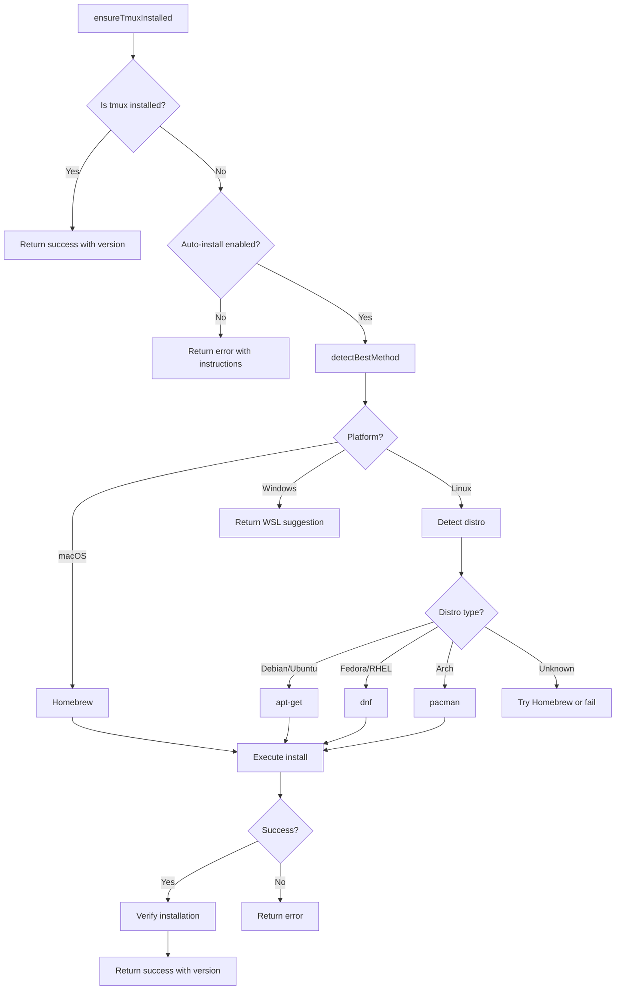

# Tmux Auto-Installer Design Document

## Overview

This document describes the architecture for a tmux auto-installer module (`src/engines/tmux/installer.ts`) that will automatically detect and install tmux on supported platforms. The design follows the patterns established in the existing OpenCode installer (`src/engines/opencode/installer.ts`).

## Architecture Overview



## Type Definitions

### TmuxInstallMethod

```typescript
/**
 * Supported installation methods for tmux.
 * Unlike OpenCode which has many npm-based options, tmux requires
 * system package managers.
 */
export type TmuxInstallMethod =
  | "homebrew"      // macOS and Linux with Homebrew
  | "apt"           // Debian, Ubuntu, and derivatives
  | "dnf"           // Fedora, RHEL 8+, CentOS Stream
  | "yum"           // RHEL 7, CentOS 7, older Fedora
  | "pacman"        // Arch Linux and derivatives
  | "zypper"        // openSUSE
  | "apk"           // Alpine Linux
  | "wsl";          // Windows - suggest WSL installation
```

### TmuxInstallResult

```typescript
/**
 * Result of a tmux installation attempt.
 */
export interface TmuxInstallResult {
  /** Whether the installation was successful */
  success: boolean;
  /** The installation method used */
  method: TmuxInstallMethod;
  /** The installed version, if successful */
  version?: string;
  /** Error message, if failed */
  error?: string;
  /** Whether sudo was required */
  usedSudo?: boolean;
}
```

### TmuxInstallerOptions

```typescript
/**
 * Options for the TmuxInstaller.
 */
export interface TmuxInstallerOptions {
  /** Preferred installation method - will be tried first if available */
  preferredMethod?: TmuxInstallMethod;
  /** Whether to show installation progress */
  verbose?: boolean;
  /** Skip sudo check - useful for containers running as root */
  skipSudoCheck?: boolean;
}
```

### LinuxDistro

```typescript
/**
 * Detected Linux distribution information.
 */
export interface LinuxDistro {
  /** Distribution ID from /etc/os-release */
  id: string;
  /** Distribution name */
  name: string;
  /** Version ID */
  versionId?: string;
  /** ID_LIKE field - parent distributions */
  idLike?: string[];
}
```

## Class Design: TmuxInstaller

```typescript
/**
 * TmuxInstaller class.
 *
 * Handles detection, version checking, and installation of tmux.
 * Unlike npm packages, tmux requires system package managers and
 * typically needs sudo privileges on Linux.
 *
 * @example
 * ```typescript
 * const installer = new TmuxInstaller({ verbose: true });
 *
 * if (!await installer.isInstalled()) {
 *   const result = await installer.install();
 *   if (result.success) {
 *     console.log(`Installed tmux ${result.version} via ${result.method}`);
 *   }
 * }
 * ```
 */
export class TmuxInstaller {
  private options: TmuxInstallerOptions;

  constructor(options?: TmuxInstallerOptions);

  // ============================================================================
  // Detection Methods
  // ============================================================================

  /**
   * Check if tmux is installed and accessible.
   * Uses 'which' on Unix-like systems and 'where' on Windows.
   *
   * @returns true if tmux is available in PATH
   */
  async isInstalled(): Promise<boolean>;

  /**
   * Get the installed tmux version.
   * Parses output from 'tmux -V' which returns "tmux X.Y".
   *
   * @returns Version string like "3.4" or null if not installed
   */
  async getVersion(): Promise<string | null>;

  /**
   * Detect the current Linux distribution.
   * Parses /etc/os-release to identify the distro.
   *
   * @returns LinuxDistro object or null if not Linux or detection fails
   */
  async detectLinuxDistro(): Promise<LinuxDistro | null>;

  /**
   * Check if sudo is available and the user can use it.
   * Runs 'sudo -n true' to check for passwordless sudo.
   *
   * @returns true if sudo is available
   */
  async isSudoAvailable(): Promise<boolean>;

  // ============================================================================
  // Installation Method Detection
  // ============================================================================

  /**
   * Detect the best installation method for the current platform.
   *
   * Priority order:
   * 1. User's preferred method, if specified and available
   * 2. Platform-specific package manager:
   *    - macOS: Homebrew
   *    - Linux: Distro-specific package manager
   *    - Windows: Return WSL suggestion
   *
   * @returns The best available installation method
   */
  async detectBestMethod(): Promise<TmuxInstallMethod>;

  /**
   * Check if a specific installation method is available.
   *
   * @param method - The method to check
   * @returns true if the method can be used
   */
  async isMethodAvailable(method: TmuxInstallMethod): Promise<boolean>;

  // ============================================================================
  // Installation Methods
  // ============================================================================

  /**
   * Install tmux using the specified or auto-detected method.
   *
   * @param method - Installation method, auto-detected if not specified
   * @returns Installation result
   */
  async install(method?: TmuxInstallMethod): Promise<TmuxInstallResult>;

  // Private installation methods
  private async installViaHomebrew(): Promise<TmuxInstallResult>;
  private async installViaApt(): Promise<TmuxInstallResult>;
  private async installViaDnf(): Promise<TmuxInstallResult>;
  private async installViaYum(): Promise<TmuxInstallResult>;
  private async installViaPacman(): Promise<TmuxInstallResult>;
  private async installViaZypper(): Promise<TmuxInstallResult>;
  private async installViaApk(): Promise<TmuxInstallResult>;

  // ============================================================================
  // Utility Methods
  // ============================================================================

  /**
   * Check if a command is available in PATH.
   */
  private async isCommandAvailable(command: string): Promise<boolean>;

  /**
   * Run a command with optional sudo.
   */
  private async runWithSudo(
    command: string[],
    useSudo: boolean
  ): Promise<{ success: boolean; stdout: string; stderr: string; exitCode: number }>;

  /**
   * Log a message if verbose mode is enabled.
   */
  private log(message: string): void;
}
```

## Platform-Specific Installation Commands

### macOS

```bash
# Homebrew - the standard method for macOS
brew install tmux
```

**Notes:**
- Homebrew does not require sudo
- If Homebrew is not installed, provide instructions to install it first
- Alternative: MacPorts (`sudo port install tmux`) - not implemented initially

### Linux - Debian/Ubuntu

```bash
# Update package list first for fresh installs
sudo apt-get update
sudo apt-get install -y tmux
```

**Detection:** Check for `/etc/debian_version` or `ID=debian|ubuntu` in `/etc/os-release`, or `ID_LIKE` containing `debian`.

**Derivatives:** Linux Mint, Pop!_OS, elementary OS, Zorin OS, etc.

### Linux - Fedora/RHEL

```bash
# Fedora, RHEL 8+, CentOS Stream
sudo dnf install -y tmux

# RHEL 7, CentOS 7 - fallback
sudo yum install -y tmux
```

**Detection:** Check for `ID=fedora|rhel|centos` in `/etc/os-release`.

### Linux - Arch

```bash
# Arch Linux and derivatives
sudo pacman -S --noconfirm tmux
```

**Detection:** Check for `ID=arch` or `ID_LIKE` containing `arch` in `/etc/os-release`.

**Derivatives:** Manjaro, EndeavourOS, Garuda Linux, etc.

### Linux - openSUSE

```bash
sudo zypper install -y tmux
```

**Detection:** Check for `ID=opensuse` or `ID_LIKE` containing `suse`.

### Linux - Alpine

```bash
# Alpine uses apk, typically in containers
apk add --no-cache tmux
```

**Detection:** Check for `ID=alpine` in `/etc/os-release`.

**Note:** Alpine containers often run as root, so sudo may not be needed.

### Windows

tmux does not run natively on Windows. The installer should:

1. Detect Windows via `process.platform === 'win32'`
2. Return a helpful error message suggesting WSL
3. Optionally detect if WSL is installed and provide specific instructions

```typescript
// Windows handling
if (process.platform === 'win32') {
  return {
    success: false,
    method: 'wsl',
    error: 'tmux is not available natively on Windows. ' +
           'Please use Windows Subsystem for Linux (WSL) to run tmux.\n\n' +
           'To install WSL:\n' +
           '  wsl --install\n\n' +
           'Then install tmux inside WSL:\n' +
           '  sudo apt-get install tmux',
  };
}
```

## Exported Convenience Function

```typescript
/**
 * Ensure tmux is installed, optionally installing it automatically.
 *
 * This is the primary entry point for most use cases.
 *
 * @param options - Installation options
 * @returns Object with installation status and version
 *
 * @example
 * ```typescript
 * const { installed, version } = await ensureTmuxInstalled({
 *   autoInstall: true,
 *   verbose: true,
 * });
 *
 * if (!installed) {
 *   throw new Error('tmux installation failed');
 * }
 * ```
 */
export async function ensureTmuxInstalled(options: {
  autoInstall?: boolean;
  preferredMethod?: TmuxInstallMethod;
  verbose?: boolean;
}): Promise<{
  installed: boolean;
  version: string | null;
  installedNow: boolean;
  method?: TmuxInstallMethod;
  error?: string;
}>;
```

## Integration with session-manager.ts

The installer should integrate with the existing `TmuxSessionManager` class:

### Option 1: Composition in session-manager.ts

```typescript
// In session-manager.ts
import { TmuxInstaller, ensureTmuxInstalled } from './installer';

export class TmuxSessionManager {
  private installer: TmuxInstaller;

  constructor(config: TmuxConfig = {}) {
    this.config = { ...DEFAULT_TMUX_CONFIG, ...config };
    this.installer = new TmuxInstaller({ verbose: config.verbose });
  }

  /**
   * Ensure tmux is available, optionally installing it.
   * Call this before creating sessions if auto-install is desired.
   */
  async ensureAvailable(autoInstall = false): Promise<boolean> {
    if (await this.isTmuxAvailable()) {
      return true;
    }

    if (!autoInstall) {
      return false;
    }

    const result = await this.installer.install();
    return result.success;
  }
}
```

### Option 2: Standalone usage before session creation

```typescript
// In calling code
import { ensureTmuxInstalled } from './engines/tmux/installer';
import { TmuxSessionManager } from './engines/tmux/session-manager';

async function setupTmuxSession() {
  // Ensure tmux is installed first
  const { installed, error } = await ensureTmuxInstalled({
    autoInstall: true,
    verbose: true,
  });

  if (!installed) {
    throw new Error(`tmux not available: ${error}`);
  }

  // Now safe to use session manager
  const manager = new TmuxSessionManager();
  await manager.createSession({ name: 'my-session' });
}
```

### Recommended: Option 2

Keep the installer as a separate module for better separation of concerns. The session manager focuses on session management, while the installer handles installation. This matches the OpenCode pattern where `installer.ts` and `server-executor.ts` are separate.

## Error Handling Strategy

### Error Types

Extend the existing `TmuxErrorCodes` in `types.ts`:

```typescript
export const TmuxErrorCodes = {
  // Existing codes
  NOT_INSTALLED: "TMUX_NOT_INSTALLED",
  SESSION_EXISTS: "SESSION_EXISTS",
  // ... existing codes ...

  // New installer-specific codes
  INSTALL_FAILED: "INSTALL_FAILED",
  SUDO_REQUIRED: "SUDO_REQUIRED",
  SUDO_NOT_AVAILABLE: "SUDO_NOT_AVAILABLE",
  UNSUPPORTED_PLATFORM: "UNSUPPORTED_PLATFORM",
  UNSUPPORTED_DISTRO: "UNSUPPORTED_DISTRO",
  PACKAGE_MANAGER_NOT_FOUND: "PACKAGE_MANAGER_NOT_FOUND",
} as const;
```

### Error Scenarios

| Scenario | Error Code | User Message |
|----------|------------|--------------|
| Windows platform | `UNSUPPORTED_PLATFORM` | tmux not available on Windows, suggest WSL |
| Unknown Linux distro | `UNSUPPORTED_DISTRO` | Could not detect distro, suggest manual install |
| No package manager found | `PACKAGE_MANAGER_NOT_FOUND` | No supported package manager found |
| sudo required but not available | `SUDO_NOT_AVAILABLE` | Installation requires sudo privileges |
| Package manager command fails | `INSTALL_FAILED` | Include stderr from failed command |

### Graceful Degradation

```typescript
async install(): Promise<TmuxInstallResult> {
  try {
    const method = await this.detectBestMethod();
    return await this.installVia(method);
  } catch (error) {
    // If primary method fails, try alternatives
    const alternatives = await this.getAlternativeMethods();
    for (const alt of alternatives) {
      try {
        const result = await this.installVia(alt);
        if (result.success) return result;
      } catch {
        continue;
      }
    }

    return {
      success: false,
      method: 'homebrew', // fallback
      error: this.getInstallationInstructions(),
    };
  }
}
```

## Linux Distribution Detection

### Reading /etc/os-release

```typescript
async detectLinuxDistro(): Promise<LinuxDistro | null> {
  if (process.platform !== 'linux') {
    return null;
  }

  try {
    const osRelease = await Bun.file('/etc/os-release').text();
    const lines = osRelease.split('\n');
    const data: Record<string, string> = {};

    for (const line of lines) {
      const match = line.match(/^(\w+)=["']?([^"'\n]*)["']?$/);
      if (match) {
        data[match[1]] = match[2];
      }
    }

    return {
      id: data.ID?.toLowerCase() ?? 'unknown',
      name: data.NAME ?? data.ID ?? 'Unknown',
      versionId: data.VERSION_ID,
      idLike: data.ID_LIKE?.split(' ').map(s => s.toLowerCase()),
    };
  } catch {
    return null;
  }
}
```

### Distro to Package Manager Mapping

```typescript
const DISTRO_PACKAGE_MANAGERS: Record<string, TmuxInstallMethod> = {
  // Debian family
  debian: 'apt',
  ubuntu: 'apt',
  linuxmint: 'apt',
  pop: 'apt',
  elementary: 'apt',
  zorin: 'apt',

  // Red Hat family
  fedora: 'dnf',
  rhel: 'dnf',
  centos: 'dnf',
  rocky: 'dnf',
  alma: 'dnf',

  // Arch family
  arch: 'pacman',
  manjaro: 'pacman',
  endeavouros: 'pacman',
  garuda: 'pacman',

  // SUSE family
  opensuse: 'zypper',
  'opensuse-leap': 'zypper',
  'opensuse-tumbleweed': 'zypper',

  // Alpine
  alpine: 'apk',
};

function getPackageManagerForDistro(distro: LinuxDistro): TmuxInstallMethod | null {
  // Direct match
  if (DISTRO_PACKAGE_MANAGERS[distro.id]) {
    return DISTRO_PACKAGE_MANAGERS[distro.id];
  }

  // Check ID_LIKE for derivatives
  if (distro.idLike) {
    for (const like of distro.idLike) {
      if (DISTRO_PACKAGE_MANAGERS[like]) {
        return DISTRO_PACKAGE_MANAGERS[like];
      }
    }
  }

  return null;
}
```

## File Structure

```
src/engines/tmux/
├── index.ts              # Module exports - add installer exports
├── installer.ts          # NEW: TmuxInstaller class and ensureTmuxInstalled
├── session-manager.ts    # Existing session management
└── types.ts              # Existing types - add installer types
```

## Module Exports Update

Update `src/engines/tmux/index.ts`:

```typescript
// ============================================================================
// Types
// ============================================================================

export type {
  // Existing types...
  TmuxSession,
  TmuxWindow,
  TmuxPane,
  TmuxConfig,
  TmuxResult,
  CreateSessionResult,
  CreateSessionOptions,
  CreateWindowOptions,
  SplitWindowOptions,
  SendKeysOptions,
  TmuxErrorCode,

  // New installer types
  TmuxInstallMethod,
  TmuxInstallResult,
  TmuxInstallerOptions,
  LinuxDistro,
} from "./types";

export {
  DEFAULT_TMUX_CONFIG,
  TmuxError,
  TmuxErrorCodes,
} from "./types";

// ============================================================================
// Session Manager
// ============================================================================

export {
  TmuxSessionManager,
  createTmuxManager,
  isTmuxAvailable,
} from "./session-manager";

// ============================================================================
// Installer
// ============================================================================

export {
  TmuxInstaller,
  ensureTmuxInstalled,
  getInstallationInstructions,
} from "./installer";
```

## Testing Strategy

### Unit Tests

```typescript
// tests/unit/engines/tmux/installer.test.ts

describe('TmuxInstaller', () => {
  describe('isInstalled', () => {
    it('should return true when tmux is in PATH');
    it('should return false when tmux is not found');
  });

  describe('getVersion', () => {
    it('should parse version from tmux -V output');
    it('should return null when tmux is not installed');
  });

  describe('detectLinuxDistro', () => {
    it('should parse /etc/os-release correctly');
    it('should handle missing fields gracefully');
    it('should return null on non-Linux platforms');
  });

  describe('detectBestMethod', () => {
    it('should return homebrew on macOS');
    it('should return apt on Ubuntu');
    it('should return dnf on Fedora');
    it('should return pacman on Arch');
    it('should return wsl on Windows');
  });

  describe('install', () => {
    // These tests would need mocking
    it('should install via homebrew on macOS');
    it('should install via apt on Debian');
    it('should handle installation failures gracefully');
  });
});
```

### Integration Tests

Integration tests should be run manually or in CI with appropriate permissions:

```typescript
// tests/integration/tmux-installer.test.ts

describe('TmuxInstaller Integration', () => {
  it('should detect if tmux is installed on the system');
  it('should get the correct tmux version');
  it('should detect the correct Linux distribution');
});
```

## Security Considerations

1. **Sudo Usage**: The installer runs package manager commands with sudo. Users should be aware that:
   - Commands are hardcoded and not user-injectable
   - Only trusted package repositories are used
   - The `-y` flag auto-confirms to avoid interactive prompts

2. **No Arbitrary Command Execution**: The installer only runs predefined commands for known package managers.

3. **Verbose Mode**: When verbose mode is enabled, command output is shown. Ensure no sensitive information is logged.

## Implementation Checklist

- [ ] Create `src/engines/tmux/installer.ts` with `TmuxInstaller` class
- [ ] Add new types to `src/engines/tmux/types.ts`
- [ ] Update `src/engines/tmux/index.ts` with new exports
- [ ] Implement platform detection for macOS, Linux, Windows
- [ ] Implement Linux distribution detection via `/etc/os-release`
- [ ] Implement installation methods for each package manager
- [ ] Add `ensureTmuxInstalled()` convenience function
- [ ] Add `getInstallationInstructions()` helper function
- [ ] Write unit tests
- [ ] Update documentation

## References

- Existing OpenCode installer: `src/engines/opencode/installer.ts`
- Existing tmux session manager: `src/engines/tmux/session-manager.ts`
- tmux official site: https://github.com/tmux/tmux
